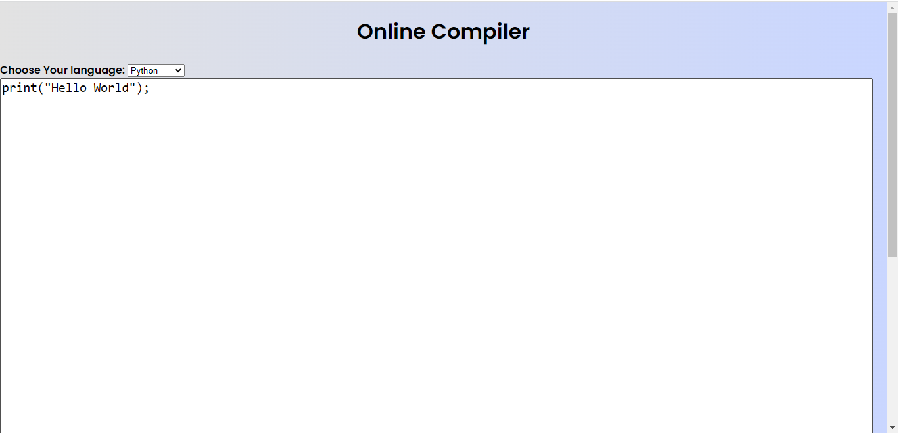

# Online-Compiler

- Online Compiler is web app that helps the user to compile and run the codes written in Java, C/C++, Python, JavaScript.
- It makes use of CodeQuotient API with the help of AJAX to compile and return the output of the code to the user.
- This project was made during my [CodeQuotient's SuperCoders Training Program](https://codequotient.com/profile/AbhinandanAdhikari).

# How to use it

- First, choose the programming language from the dropdown.
- Then, write the code in the coding area.
- Click on compile button to compile your code.
- Wait for few seconds to get the output.

# Screenshots
## Coding Area:

## Output Area:

Hope you all like it :heart:
